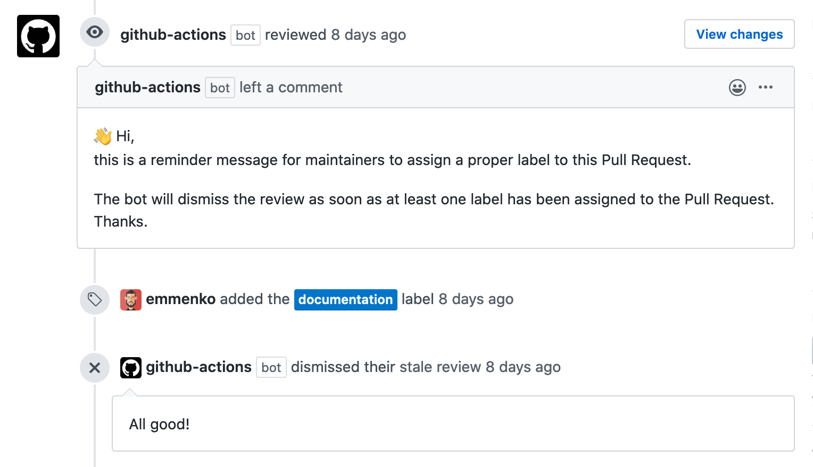

I've been playing around and using GitHub Actions for some time now and so far it has been a good experience. I also started contributing here and there to some community-built actions and that gave me a chance to deep dive into them.

To my positive surprise, it's actually very simple to work with them. Kudos to GitHub for building a very accessible framework!

With that in mind I decided to build a simple action that I could try and use at work.
The idea is to build an action to check that a Pull Request has at least one label assigned.

**TL;DR**: check out the code at https://github.com/emmenko/action-verify-pr-labels

# Implementing the GitHub Action

A GitHub Action is technically just a JavaScript package and thus we need:

- A `package.json`, to list the necessary dependencies and the package main file.
- An `action.yml`, to describe the [metadata](https://help.github.com/en/actions/building-actions/metadata-syntax-for-github-actions) of the action.
- The entry point of the action, usually an `index.js` file.

To facilitate the implementation of an action, GitHub provides different helper packages. For the action we are going to build, we need the [@actions/core](https://www.npmjs.com/package/@actions/core) package and the [@actions/github](https://www.npmjs.com/package/@actions/github) package.

```json title="package.json"
{
  "name": "action-verify-pr-labels",
  "version": "1.0.0",
  "license": "MIT",
  "dependencies": {
    "@actions/core": "1.2.4",
    "@actions/github": "2.2.0"
  }
}
```

Next, create the `action.yml` metadata file:

```yaml title="action.yml"
name: 'Verify Pull Request Labels'
description: 'Verify that the Pull Request has at least one valid label'
inputs:
  github-token:
    description: 'Token provided by GitHub'
    required: true
runs:
  using: 'node12'
  main: 'index.js'
```

Notice that we describe what inputs the action supports. Inputs are key-value parameters that you would [pass to the job step](https://help.github.com/en/actions/reference/workflow-syntax-for-github-actions#jobsjob_idstepswith) with the `with` option.

In our case, we require the GitHub token for making HTTP API requests using the Oktokit SDK from the [@actions/github](https://www.npmjs.com/package/@actions/github) package.

The last thing to do is to write the actual code, in the `index.js` file.

## Expected behavior

We expect the action to roughly do the following:

- Get the list of assigned labels from the Pull Request.
- If there is a label assigned, and the action runs for the first time, don't do anything.
- If there is no label assigned, trigger a "**Request changes**" status with a comment to remind the user to assign a label.
- If a label gets assigned, and there was a change request from the action bot before, dismiss the review.

## Getting down to business

Since we're going to perform asynchronous operations, we need to prepare the code to deal with Promises. I personally like the `async/await` syntax, so I'm going to use that.

```js title="index.js"
const core = require('@actions/core');

(async () => {
  try {
    // TODO: our implementation
  } catch (error) {
    await core.setFailed(error.stack || error.message);
  }
})();
```

> NOTE: we're using an immediately-invoked function expression (IIFE) to use the `async/await` syntax. There is a [new JavaScript syntax proposal](https://github.com/tc39/proposal-top-level-await) to use a top-level `await`. Until this is natively supported, we're going to use the workaround with the IIFE.

The code snippet above is just a basic scaffolding for running some asynchronous JavaScript code and handle possible errors. In case there is an error, we're using the `core.setFailed` helper function to make the action fail.

### Initializing Oktokit HTTP Client
The next thing to do is to prepare all the necessary information from the GitHub Action workflow.

```js title="index.js" highlightLines="2,6-10"
const core = require('@actions/core');
const github = require('@actions/github');

(async () => {
  try {
    const owner = github.context.repo.owner;
    const repo = github.context.repo.repo;
    const ref = github.context.ref;
    const gitHubToken = core.getInput('github-token', { required: true });
    const octokit = new GitHub(gitHubToken);

    // TODO: our implementation
  } catch (error) {
    await core.setFailed(error.stack || error.message);
  }
})();
```

Here we're getting some information from the `github.context` object, the GitHub token from the input parameter `github-token`, and we're initializing the Oktokit SDK client to make HTTP API requests.

### Getting the Pull Request labels

The next step is to get the Pull Request labels. To do that, we need to know the Pull Request number.

```js title="index.js" highlightLines="4-9,16,20-33"
const core = require('@actions/core');
const github = require('@actions/github');

const getPullRequestNumber = (ref) => {
  core.debug(`Parsing ref: ${ref}`);
  // This assumes that the ref is in the form of `refs/pull/:prNumber/merge`
  const prNumber = ref.replace(/refs\/pull\/(\d+)\/merge/, '$1');
  return parseInt(prNumber, 10);
};

(async () => {
  try {
    const owner = github.context.repo.owner;
    const repo = github.context.repo.repo;
    const ref = github.context.ref;
    const prNumber = github.context.issue.number || getPullRequestNumber(ref);
    const gitHubToken = core.getInput('github-token', { required: true });
    const octokit = new GitHub(gitHubToken);

    const getPrLabels = async (prNumber) => {
      const { data } = await octokit.pulls.get({
        pull_number: prNumber,
        owner,
        repo,
      });
      if (data.length === 0) {
        throw new Error(`No Pull Requests found for ${prNumber} (${ref}).`);
      }
      return data.labels.map((label) => label.name);
    };

    const prLabels = await getPrLabels(prNumber);
    core.debug(`Found PR labels: ${prLabels.toString()}`);

    // TODO: our implementation
  } catch (error) {
    await core.setFailed(error.stack || error.message);
  }
})();
```

The Pull Request number can be derived by the `issue.number` (depending on how the action is triggered) or by inspecting the Pull Request `ref`.

With the list of potentially assigned labels, we can now start to implement the logic for the requirements that we initially defined.

### Updating the Pull Request review status

Let's start with the basics. If the Pull Request has labels assigned, we exit the process and don't do anything. If not, we create a "**Request Changes**" review, with a friendly message.

```js title="index.js" highlightLines="35-50"
const core = require('@actions/core');
const github = require('@actions/github');

const getPullRequestNumber = (ref) => {
  core.debug(`Parsing ref: ${ref}`);
  // This assumes that the ref is in the form of `refs/pull/:prNumber/merge`
  const prNumber = ref.replace(/refs\/pull\/(\d+)\/merge/, '$1');
  return parseInt(prNumber, 10);
};

(async () => {
  try {
    const owner = github.context.repo.owner;
    const repo = github.context.repo.repo;
    const ref = github.context.ref;
    const prNumber = github.context.issue.number || getPullRequestNumber(ref);
    const gitHubToken = core.getInput('github-token', { required: true });
    const octokit = new GitHub(gitHubToken);

    const getPrLabels = async (prNumber) => {
      const { data } = await octokit.pulls.get({
        pull_number: prNumber,
        owner,
        repo,
      });
      if (data.length === 0) {
        throw new Error(`No Pull Requests found for ${prNumber} (${ref}).`);
      }
      return data.labels.map((label) => label.name);
    };

    const prLabels = await getPrLabels(prNumber);
    core.debug(`Found PR labels: ${prLabels.toString()}`);

    if (prLabels.length > 0) {
      core.info(`Pull Request has at least a label. All good!`);
      return
    }

    const reviewMessage = `👋 Hi,
this is a reminder message for maintainers to assign a proper label to this Pull Request.
The bot will dismiss the review as soon as at least one label has been assigned to the Pull Request.
Thanks.`;
    await octokit.pulls.createReview({
      owner,
      repo,
      pull_number: prNumber,
      body: reviewMessage,
      event: 'REQUEST_CHANGES',
    });
  } catch (error) {
    await core.setFailed(error.stack || error.message);
  }
})();
```

### Dismissing a stale review

If the Pull Request has at least one label assigned and there was previously a change request, we need to dismiss the stale review.

To do so, we get the status of the **last review** from the action bot and check if it's not been `DISMISSED`.

```js title="index.js" highlightLines="35-50,55-66"
const core = require('@actions/core');
const github = require('@actions/github');

const getPullRequestNumber = (ref) => {
  core.debug(`Parsing ref: ${ref}`);
  // This assumes that the ref is in the form of `refs/pull/:prNumber/merge`
  const prNumber = ref.replace(/refs\/pull\/(\d+)\/merge/, '$1');
  return parseInt(prNumber, 10);
};

(async () => {
  try {
    const owner = github.context.repo.owner;
    const repo = github.context.repo.repo;
    const ref = github.context.ref;
    const prNumber = github.context.issue.number || getPullRequestNumber(ref);
    const gitHubToken = core.getInput('github-token', { required: true });
    const octokit = new GitHub(gitHubToken);

    const getPrLabels = async (prNumber) => {
      const { data } = await octokit.pulls.get({
        pull_number: prNumber,
        owner,
        repo,
      });
      if (data.length === 0) {
        throw new Error(`No Pull Requests found for ${prNumber} (${ref}).`);
      }
      return data.labels.map((label) => label.name);
    };

    const prLabels = await getPrLabels(prNumber);
    core.debug(`Found PR labels: ${prLabels.toString()}`);

    const reviews = await octokit.pulls.listReviews({
      owner,
      repo,
      pull_number: prNumber,
    });
    const allReviewsFromActionsBot = reviews.data.filter(
      (review) => review.user.login === 'github-actions[bot]'
    );
    const lastReviewFromActionsBot =
      allReviewsFromActionsBot.length > 0 &&
      allReviewsFromActionsBot[allReviewsFromActionsBot.length - 1];
    core.debug(
      `Last review from actions bot: ${JSON.stringify(
        lastReviewFromActionsBot
      )}`
    );

    if (prLabels.length > 0) {
      core.info(`Pull Request has at least a label. All good!`);

      if (
        lastReviewFromActionsBot &&
        lastReviewFromActionsBot.state !== 'DISMISSED'
      ) {
        await octokit.pulls.dismissReview({
          owner,
          repo,
          pull_number: prNumber,
          review_id: lastReviewFromActionsBot.id,
          message: 'All good!',
        });
      }
      return
    }

    const reviewMessage = `👋 Hi,
this is a reminder message for maintainers to assign a proper label to this Pull Request.
The bot will dismiss the review as soon as at least one label has been assigned to the Pull Request.
Thanks.`;
    await octokit.pulls.createReview({
      owner,
      repo,
      pull_number: prNumber,
      body: reviewMessage,
      event: 'REQUEST_CHANGES',
    });
  } catch (error) {
    await core.setFailed(error.stack || error.message);
  }
})();
```

### Skipping if changes were already requested

As a last improvement, we can check if the last review from the action bot is a `CHANGES_REQUESTED`, in which case we can exit and avoid requesting yet another change.

```js title="index.js" highlightLines="70-76"
const core = require('@actions/core');
const github = require('@actions/github');

const getPullRequestNumber = (ref) => {
  core.debug(`Parsing ref: ${ref}`);
  // This assumes that the ref is in the form of `refs/pull/:prNumber/merge`
  const prNumber = ref.replace(/refs\/pull\/(\d+)\/merge/, '$1');
  return parseInt(prNumber, 10);
};

(async () => {
  try {
    const owner = github.context.repo.owner;
    const repo = github.context.repo.repo;
    const ref = github.context.ref;
    const prNumber = github.context.issue.number || getPullRequestNumber(ref);
    const gitHubToken = core.getInput('github-token', { required: true });
    const octokit = new GitHub(gitHubToken);

    const getPrLabels = async (prNumber) => {
      const { data } = await octokit.pulls.get({
        pull_number: prNumber,
        owner,
        repo,
      });
      if (data.length === 0) {
        throw new Error(`No Pull Requests found for ${prNumber} (${ref}).`);
      }
      return data.labels.map((label) => label.name);
    };

    const prLabels = await getPrLabels(prNumber);
    core.debug(`Found PR labels: ${prLabels.toString()}`);

    const reviews = await octokit.pulls.listReviews({
      owner,
      repo,
      pull_number: prNumber,
    });
    const allReviewsFromActionsBot = reviews.data.filter(
      (review) => review.user.login === 'github-actions[bot]'
    );
    const lastReviewFromActionsBot =
      allReviewsFromActionsBot.length > 0 &&
      allReviewsFromActionsBot[allReviewsFromActionsBot.length - 1];
    core.debug(
      `Last review from actions bot: ${JSON.stringify(
        lastReviewFromActionsBot
      )}`
    );

    if (prLabels.length > 0) {
      core.info(`Pull Request has at least a label. All good!`);

      if (
        lastReviewFromActionsBot &&
        lastReviewFromActionsBot.state !== 'DISMISSED'
      ) {
        await octokit.pulls.dismissReview({
          owner,
          repo,
          pull_number: prNumber,
          review_id: lastReviewFromActionsBot.id,
          message: 'All good!',
        });
      }
      return
    }

    if (
      lastReviewFromActionsBot &&
      lastReviewFromActionsBot.state === 'CHANGES_REQUESTED'
    ) {
      core.info(`Skipping REQUEST_CHANGES review`);
      return;
    }

    const reviewMessage = `👋 Hi,
this is a reminder message for maintainers to assign a proper label to this Pull Request.
The bot will dismiss the review as soon as at least one label has been assigned to the Pull Request.
Thanks.`;
    await octokit.pulls.createReview({
      owner,
      repo,
      pull_number: prNumber,
      body: reviewMessage,
      event: 'REQUEST_CHANGES',
    });
  } catch (error) {
    await core.setFailed(error.stack || error.message);
  }
})();
```

# Testing the action

Now that we finished implementing our GitHub Action, we can test it in the same repository.

Create a `.github/workflow/main.yml` workflow file:

```yaml title="main.yml" highlightLines="20-23"
name: Verify Pull Request Labels

on:
  pull_request:
    types: [ready_for_review, review_requested, labeled, unlabeled]

jobs:
  verify_pr_labels:
    if: github.event.pull_request.draft == false

    runs-on: ubuntu-latest

    steps:
      - name: Checkout
        uses: actions/checkout@v2

      - name: Install github actions dependencies
        uses: bahmutov/npm-install@v1.1.0

      - name: Verify Pull Request Labels
        uses: ./
        with:
          github-token: '${{ secrets.GITHUB_TOKEN }}'
```

When you open the Pull Request (depending on the type of triggers), the action should run and request changes. After assigning a label, the action runs again and dismisses the stale review.



# Publishing the action (optional)

At this point the GitHub Action is done. People can use it by referencing the GitHub repository:

```yaml highlightLines="2"
- name: Verify Pull Request Labels
  uses: emmenko/action-verify-pr-labels@master
  with:
    github-token: '${{ secrets.GITHUB_TOKEN }}'
```

Additionally, you can choose to [publish the action to the GitHub Marketplace](https://help.github.com/en/actions/creating-actions/publishing-actions-in-github-marketplace) and tag a git version.

# Conclusion

Developing GitHub Action is not too hard. At the end of the day is "just JavaScript". Hopefully this article gives you the motivation and the confidence to try it out for yourself to build amazing actions.
