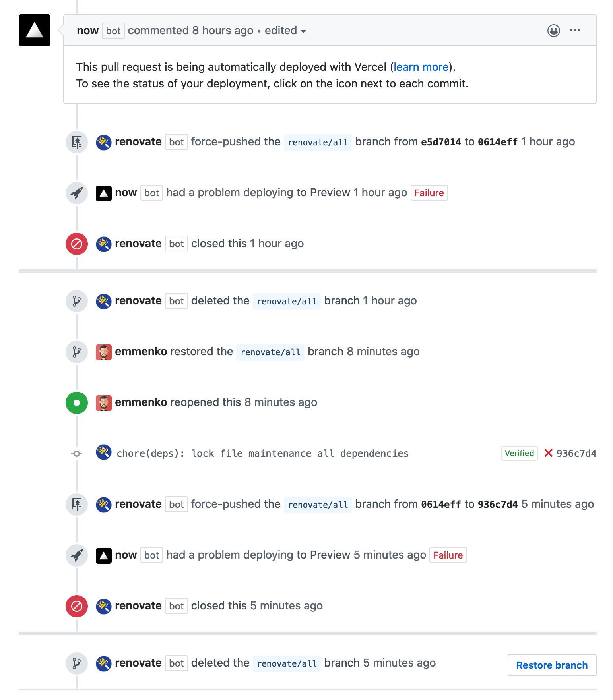

At work we're using the [Renovate](https://github.com/apps/renovate) GitHub App to manage dependency updates in most of our repositories.

We have been very happy with Renovate and we like the level of configurability that you can achieve. In fact, for our monorepositories we have been using the grouping feature to aggregate updates in single Pull Requests. We also have weekly scheduled updates, to reduce the "noise" in GitHub and CI.

The Renovate configuration used to look like this:

```json title=".renovaterc.json"
{
  "extends": [
    "config:base",
    ":pinOnlyDevDependencies",
    "schedule:weekly"
  ],
  "separateMajorMinor": true,
  "groupName": "all dependencies",
  "groupSlug": "all",
  "packageRules": [
    {
      "packagePatterns": [
        "*"
      ],
      "groupName": "all dependencies",
      "groupSlug": "all"
    }
  ],
  "lockFileMaintenance": {
    "enabled": true
  }
}
```

Recently however, we started noticing weird behaviors where Renovate will open a Pull Request and close it soon after, without any apparent reason.



I [reached for help](https://github.com/renovatebot/config-help/issues/632) in the `renovatebot/config-help` repository and, after some investigation, [Rhys Arkins](https://github.com/rarkins) suggested to change a bit the configuration. The assumption being that the mix of rules and `lockFileMaintenance` was causing some unexpected issues.

The updated config looks like this:

```diff title=".renovaterc.json" highlightLines="8-9,15"
{
  "extends": [
    "config:base",
    ":pinOnlyDevDependencies",
    "schedule:weekly"
  ],
  "separateMajorMinor": true,
-  "groupName": "all dependencies",
-  "groupSlug": "all",
  "packageRules": [
    {
      "packagePatterns": [
        "*"
      ],
+      "updateTypes": ["minor", "patch"],
      "groupName": "all dependencies",
      "groupSlug": "all"
    }
  ],
  "lockFileMaintenance": {
    "enabled": true
  }
}
```

**TL;DR** Avoid combining major updates into groups.

Now major updates are treated as individual Pull Requests, and the issue with Renovate closing the Pull Requests seems to be solved.
